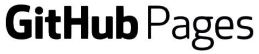

<h1 align="center"><b>Jang Han</b></h1>

<h2 align="center">💫 Current Interest</h2>

<ul style="list-style-type: disc; margin-left: 20px; font-weight: bold;">
  <li>Deep Learning</li>
  <li>Machine Learning</li>
  <li>Medical Imaging</li>
</ul>

<h2 align="center">📝 Experiences</h2>

<h3>NanoCellect Biomedical</h3>

<strong>Machine Learning Engineer (Internship)</strong> 
San Diego, CA, US 
2024. 4. ~ 2025. 2. (scheduled)

<h3>Seoul National University of Science and Technology (SEOULTECH)</h3>

<strong>Undergraduate Research Student</strong> 
Seoul, South Korea 
2023. 12. ~ 2024. 8.

<h3>Korea Institute of Science and Technology (KIST)</h3>

<strong>Undergraduate Research Student</strong> 
Seoul, South Korea 
2023. 6. ~ 2023. 12.

<h3>Institute for Basic Science (IBS)</h3>

<strong>Undergraduate Research Student</strong> 
Daejeon, South Korea 
2023. 2. ~ 2023. 6. 
2022. 4. ~ 2022. 10.

<h3>Chungnam National University (CNU)</h3>

<strong>Bachelor’s Student</strong> 
Daejeon, South Korea 
2019. 3. ~ Present

<!-- <h2 align="center">📖 Blog</h2>

<h2 align="center">⌨️ Tech Stack</h2>

 

 -->

<h2 align="center">🏃‍ Info</h2>

<h2 align="center">☎️ Contact</h2>

<!--

# <b>Jang Han</b>

## 💫 Current Interest
- Deep Learning
- Biology
- Health Care
 
## 📝 Current study
* 💻 Computer Science
   * *The Division of Computer Convergence (CNU, Chungnam National University)*
   * *The Department of Artificial Intelligence (CNU, Chungnam National University)*
* 🧠 Cognitive Neuroscience
   * *IBS(Institute for Basic Science), CCS(Center For Cognition and Sociality) Undergraduate Research Student*
* ⚕️ Medical Imaging
   * *KIST(Korea Institute of Science and Technology), Biomedical Research Division, Undergraduate Research Student*

## 📖 Blog

## ⌨️ Tech Stack

 

## 🏃‍ Info

## ☎️ Contact

-->

